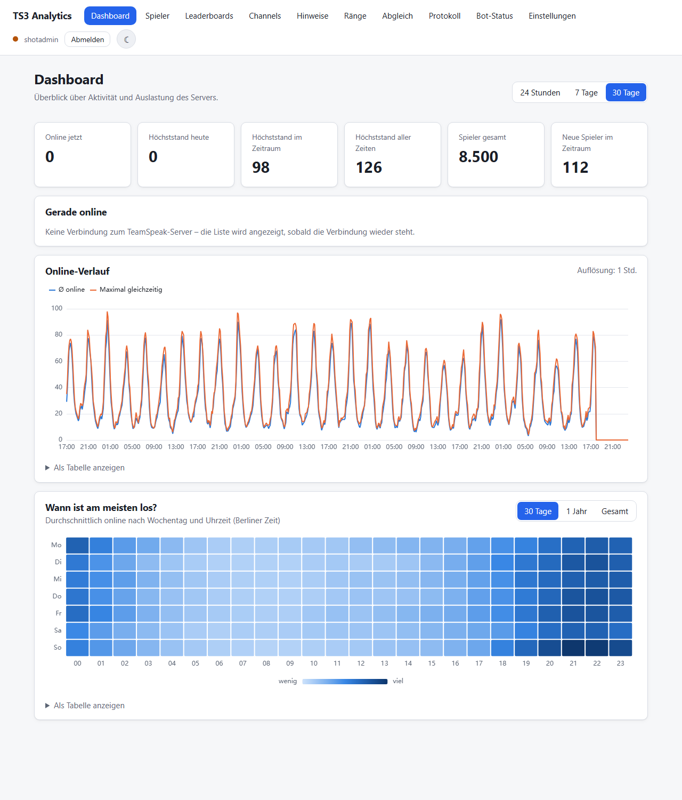
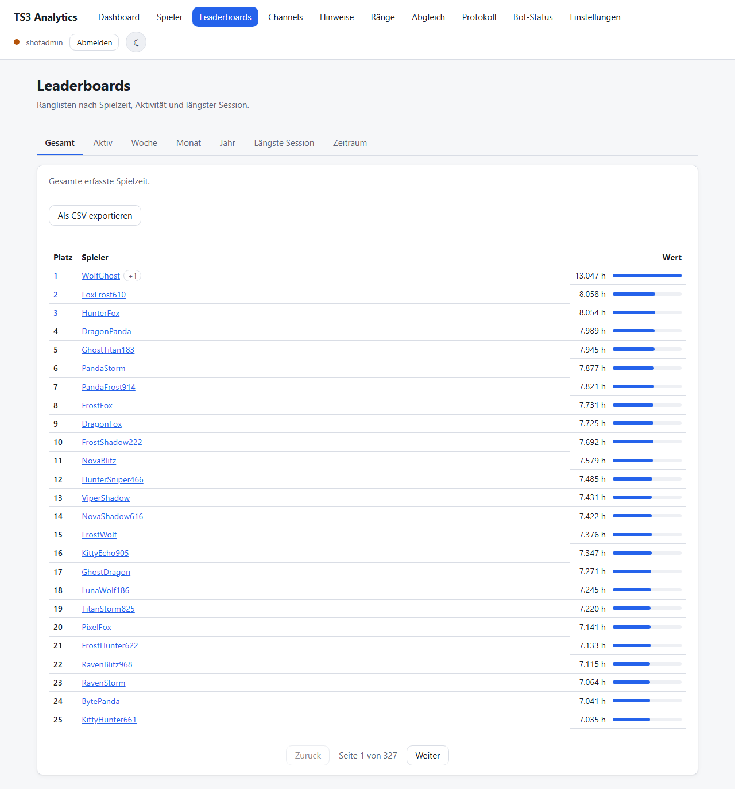
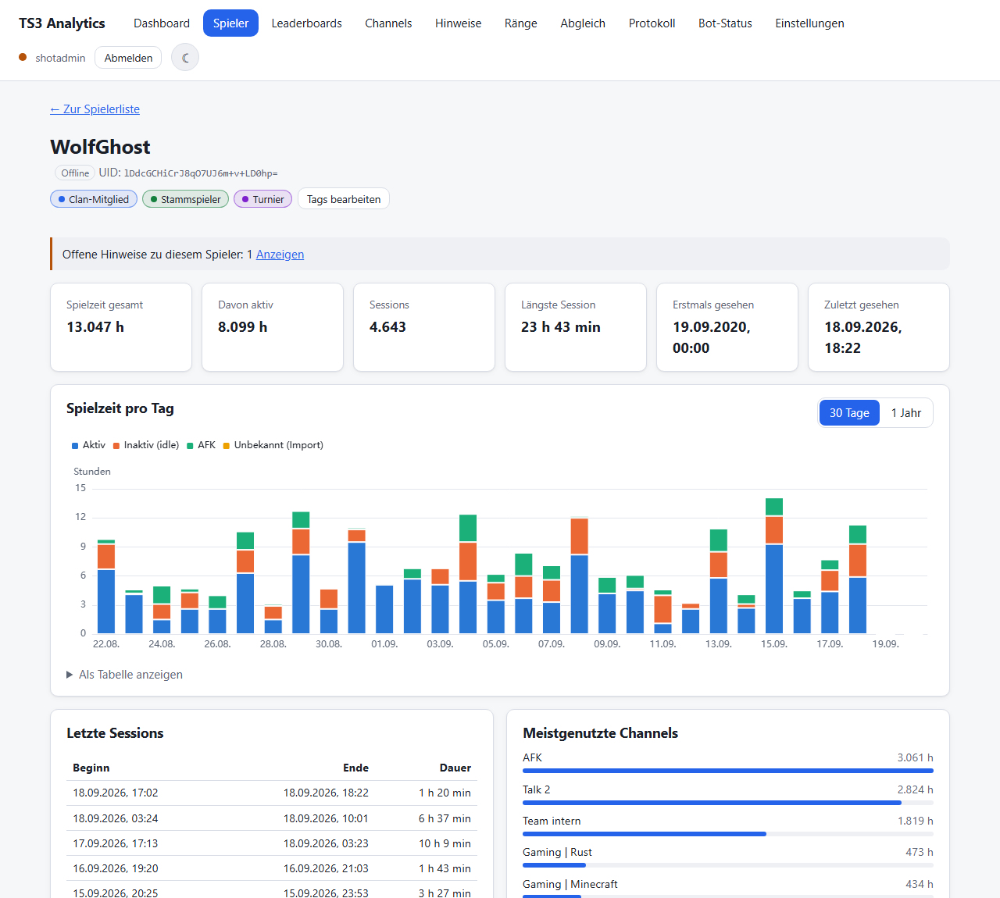
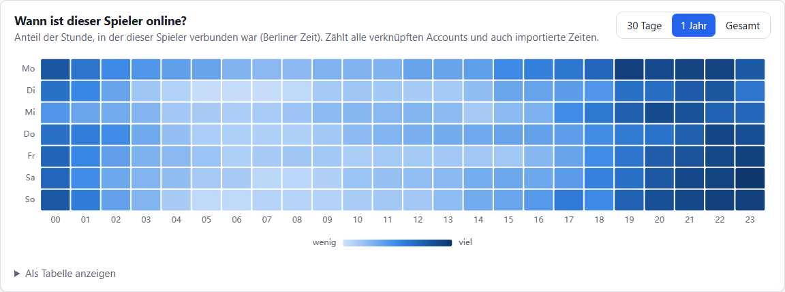
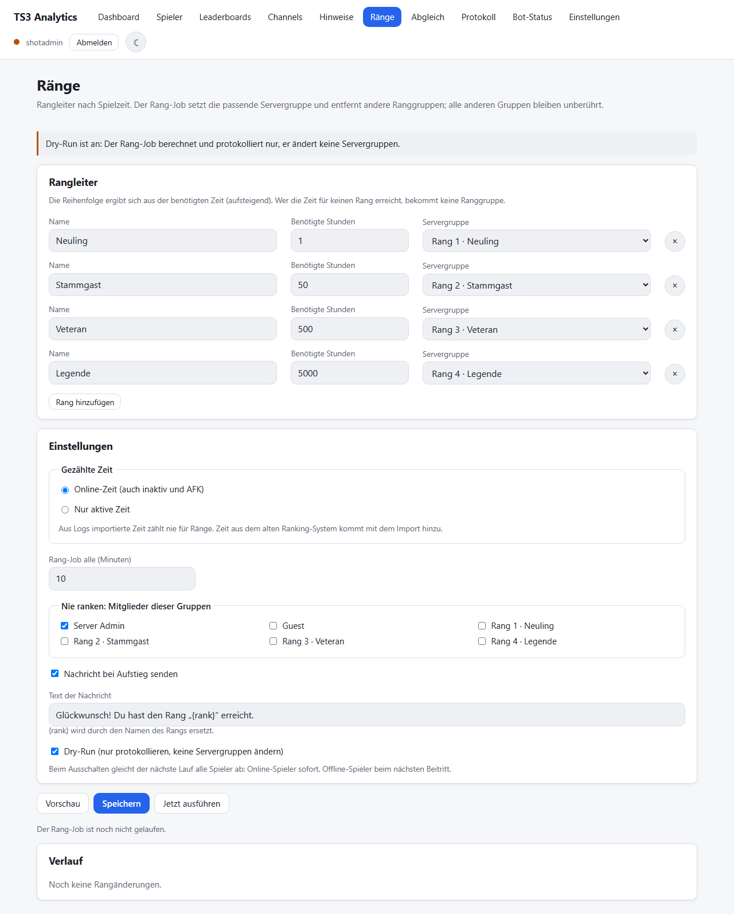
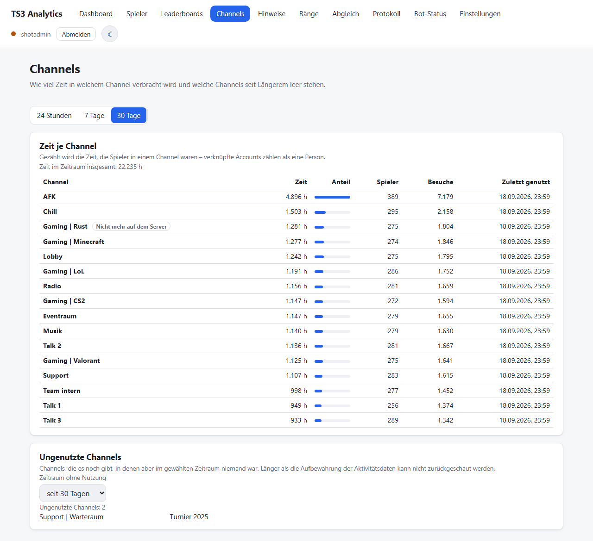
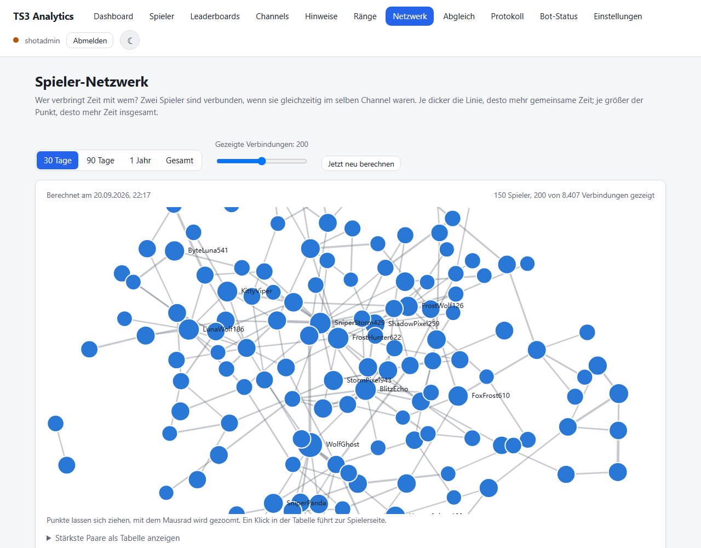

# TS3 Analytics

Statistiken, Leaderboards und ein automatisches Rangsystem für einen TeamSpeak-3-Server – als
eigenständiger Windows-Dienst mit lokalem Webinterface.

Der Dienst verbindet sich per ServerQuery (SSH) mit dem TeamSpeak-Server, zeichnet auf, wer wann
wie lange online war, und stellt das Ganze im Browser dar. Er kann Servergruppen nach Spielzeit
vergeben, Zweitaccounts und Ban-Umgehungen erkennen, Moderationsaktionen ausführen und die
Historie aus alten Serverlogs sowie aus einem früheren Rangsystem übernehmen.

## Oberfläche

| Dashboard                                    | Leaderboards                                       |
| -------------------------------------------- | -------------------------------------------------- |
|  |  |

Spielerseite mit Spielzeit pro Tag, Sessions, meistgenutzten Channels, Tags und Notizen:



Darunter zeigt dieselbe Seite, wann dieser Spieler üblicherweise online ist:



| Rangsystem                           | Channel-Statistik                          |
| ------------------------------------ | ------------------------------------------ |
|  |  |

Wer verbringt Zeit mit wem? Das Netzwerk verbindet Spieler, die gemeinsam im selben Channel waren:



## Funktionen

- **Zeiterfassung** pro Spieler: Online-Zeit, aktive Zeit, inaktiv, AFK; Sessions, Nickname-Verlauf,
  genutzte Channels. Verknüpfte UIDs zählen als eine Person.
- **Leaderboards**: gesamt, aktiv, Woche, Monat, Jahr, längste Session, freier Zeitraum, CSV-Export.
- **Server-Statistik**: Online-Verlauf, Höchststände, Heatmap nach Wochentag und Uhrzeit,
  Nutzung je Channel und Liste der Channels, in denen länger niemand war.
- **Wann ist wer da?** Dasselbe Wochentag-Raster gibt es je Spieler: Anteil jeder Stunde, in der
  dieser Spieler verbunden war – auf einen Blick zu sehen, wann sich jemand antreffen lässt.
- **Rangsystem**: Rangleiter im Webinterface konfigurierbar, vergibt Servergruppen nach Spielzeit,
  mit Ausnahmen, Bonuszeit, eingefrorenen Rängen und Aufstiegsnachricht. Startet im Probelauf.
- **Admin-Werkzeuge**: Hinweise auf Zweitaccounts und Ban-Umgehung, Notizen, Tags, Banlisten-Spiegel,
  Moderation (kicken, bannen, anstupsen, verschieben, Nachricht), Audit-Log, Discord-Benachrichtigungen.
- **Spieler-Netzwerk**: Kraft-gerichteter Graph, wer häufig mit wem im selben Channel ist –
  AFK-Zeiten und ausgewählte Channels bleiben außen vor. Wird einmal täglich berechnet.
- **Datenschutz**: Auskunft als JSON-Export und Anonymisierung pro Spieler.
- **Import der Historie**: alte Serverlogs und die Datenbank des früheren Rangsystems.

## Voraussetzungen

- Windows Server (entwickelt gegen Windows 11 / Server 2016)
- [Node.js 22 LTS](https://nodejs.org/) (64 Bit), pnpm über Corepack
- [NSSM](https://nssm.cc/) für den Dienst
- TeamSpeak-3-Server mit aktivierter **ServerQuery über SSH** (Standardport 10022) und einem
  Query-Account mit den Rechten weiter unten

## Installation

PowerShell **als Administrator** öffnen:

```
cd C:\apps\ts3-analytics
powershell -ExecutionPolicy Bypass -File .\scripts\setup.ps1 install
```

Das Skript prüft Node und NSSM, installiert die Abhängigkeiten, legt `.env` aus `.env.example` an,
erzeugt das `HMAC_SECRET`, baut die Anwendung und richtet den Dienst ein. Fehlen danach noch der
Query-Benutzer und sein Passwort in `.env`, sagt es das und startet den Dienst noch nicht.

Danach das erste Konto für das Webinterface anlegen:

```
corepack pnpm admin:user create <name>
```

Die Weboberfläche läuft auf `http://127.0.0.1:8080/` und ist **nur lokal** erreichbar – Zugriff per
Remotedesktop oder SSH-Tunnel. Sie gehört nicht ins offene Internet.

### Das Setup-Skript

```
.\scripts\setup.ps1 <befehl> [optionen]
```

| Befehl      | Was passiert                                                                            |
| ----------- | --------------------------------------------------------------------------------------- |
| `install`   | Abhängigkeiten, `.env` samt `HMAC_SECRET`, Build, Dienst einrichten und starten         |
| `update`    | Dienst anhalten, sichern, `git pull --ff-only`, neu bauen, Dienst starten               |
| `start`     | Dienst starten und auf `/api/health` warten                                             |
| `stop`      | Dienst anhalten (offene Sitzungen werden sauber geschlossen)                            |
| `uninstall` | Dienst entfernen; Datenbank, Logs, Sicherungen und `.env` bleiben liegen                |
| `status`    | Dienstzustand, fehlende Werte in `.env`, Größe der Datenbank und Health auf einen Blick |

| Option                | Wirkung                                                                                     |
| --------------------- | ------------------------------------------------------------------------------------------- |
| `-ServiceName <name>` | Name des Windows-Dienstes, Vorgabe `ts3-analytics`                                          |
| `-Nssm <pfad>`        | Pfad zu `nssm.exe`, falls sie nicht im PATH liegt                                           |
| `-Yes`                | keine Rückfragen stellen                                                                    |
| `-SkipBackup`         | nur bei `update`: keine Sicherung vor dem Update                                            |
| `-PurgeData`          | nur bei `uninstall`: `data\` mit Datenbank, Logs und Sicherungen löschen (fragt zusätzlich) |

`install`, `update` und `uninstall` brauchen Administratorrechte, `start`, `stop` und `status` nicht.
Ohne Skript geht alles auch von Hand – die Schritte stehen in [docs/betrieb.md](docs/betrieb.md).

## Rechte des Query-Accounts

Der Bot kommt mit **Leserechten** aus. Alles, was den Server verändert, ist optional und
standardmäßig abgeschaltet. Die Rechte gehören in eine eigene ServerQuery-Gruppe des Accounts.

### Grundbetrieb (Pflicht)

| Recht                             | Wofür                                                     |
| --------------------------------- | --------------------------------------------------------- |
| `b_serverquery_login`             | Anmeldung als ServerQuery-Client                          |
| `b_virtualserver_select`          | den virtuellen Server auswählen                           |
| `b_virtualserver_client_list`     | wer gerade online ist (`clientlist`)                      |
| `b_virtualserver_channel_list`    | Channelnamen (`channellist`)                              |
| `b_virtualserver_notify_register` | Ereignisse abonnieren: Verbinden, Trennen, Channelwechsel |

### Optionale Funktionen

| Funktion                                  | Recht                                                     | Ohne das Recht                                    |
| ----------------------------------------- | --------------------------------------------------------- | ------------------------------------------------- |
| Länder-Statistik, IP-Hinweise             | `b_client_remoteaddress_view`                             | keine Länder, keine Erkennung von Zweitaccounts   |
| Banlisten-Spiegel                         | `b_client_ban_list`                                       | keine Ban-Übersicht, keine Ban-Umgehungs-Hinweise |
| Servergruppen-Überwachung                 | `b_virtualserver_log_view`                                | keine Meldung bei Gruppenänderungen               |
| Gruppen zur Auswahl anzeigen              | `b_virtualserver_servergroup_list`                        | Gruppen müssen von Hand eingetragen werden        |
| Rangsystem                                | `i_group_member_add_power`, `i_group_member_remove_power` | Ränge werden nur berechnet, nicht gesetzt         |
| Moderation: kicken                        | `i_client_kick_from_server_power`                         | Aktion schlägt fehl                               |
| Moderation: bannen                        | `b_client_ban_create`                                     | Aktion schlägt fehl                               |
| Moderation: anstupsen                     | `i_client_poke_power`                                     | Aktion schlägt fehl                               |
| Moderation: Nachricht, Aufstiegsnachricht | `i_client_private_textmessage_power`                      | Nachricht wird nicht zugestellt                   |
| Moderation: verschieben                   | `i_client_move_power`                                     | Aktion schlägt fehl                               |

**Zu den `i_…_power`-Rechten:** Sie wirken nur, wenn ihr Wert über dem entsprechenden
`…needed…`-Recht des Ziels liegt – also `i_client_kick_from_server_power` über
`i_client_needed_kick_from_server_power` des betroffenen Spielers und `i_group_member_add_power`
über `i_group_needed_member_add_power` der Rang-Gruppe. Ein Admin bleibt also unantastbar, solange
seine Gruppe höhere Werte hat.

**Anti-Flood:** Der Bot fragt regelmäßig Listen ab und würde sonst gesperrt. Entweder die IP des
Bots in `query_ip_allowlist.txt` des TeamSpeak-Servers eintragen (bei gleichem Server genügt
`127.0.0.1`) oder dem Query-Account `b_client_ignore_antiflood` geben. Zusätzlich drosselt der
Dienst sich selbst (`TS3_QUERY_RATE_LIMIT`, Vorgabe 5 Befehle pro Sekunde).

Fehlt ein Recht, meldet der Dienst das als Warnung; sie steht auf der Seite „Bot-Status“.

## Konfiguration

Alle Werte stehen in `.env`, beschrieben in [.env.example](.env.example). Wichtig sind:

| Wert                                   | Bedeutung                                                            |
| -------------------------------------- | -------------------------------------------------------------------- |
| `TS3_HOST`, `TS3_QUERY_PORT`           | Adresse des TeamSpeak-Servers und SSH-Query-Port (Vorgabe 10022)     |
| `TS3_QUERY_USER`, `TS3_QUERY_PASSWORD` | Zugangsdaten des Query-Accounts                                      |
| `TS3_SERVER_ID`                        | virtueller Server                                                    |
| `HMAC_SECRET`                          | Schlüssel für die IP-Prüfsummen – **nach Inbetriebnahme nie ändern** |
| `WEB_HOST`, `WEB_PORT`                 | Webinterface, nur Loopback erlaubt                                   |
| `IP_RETENTION_DAYS`                    | wie lange IP-Prüfsummen aufbewahrt werden                            |

**IP-Adressen werden nie im Klartext gespeichert.** Aus einer Adresse wird zuerst das Land
bestimmt, dann bleibt nur eine HMAC-SHA256-Prüfsumme der Adresse und ihres Subnetzes übrig.

## Historische Daten übernehmen

Beide Importe arbeiten auf **Kopien** und ändern die Quellen nie:

```
corepack pnpm import:logs <ordner> --dry-run --clients <kopie von ts3server.sqlitedb>
corepack pnpm import:ranking <kopie der sinusbot-datenbank> --dry-run
```

Jeder Lauf hat einen Probemodus mit ausführlichem Bericht. Details, Grenzen und die Bedeutung der
Zahlen stehen in [docs/import-logs.md](docs/import-logs.md) und
[docs/import-legacy-ranking.md](docs/import-legacy-ranking.md). Aus Logs übernommene Zeit zählt nur
für Statistiken, für Ränge zählt die Zeit des alten Rangsystems bis zum Stichtag plus die eigene
Erfassung danach – nie beides.

## Betrieb

- **Sicherungen** laufen täglich automatisch nach `data/backups`; von Hand mit `corepack pnpm backup`.
  Wiederherstellung: [docs/backup.md](docs/backup.md).
- **Logs** liegen in `data/logs`, eine Datei pro Tag. Passwörter, Tokens und IP-Adressen werden
  geschwärzt. Die letzten Warnungen stehen auch auf der Seite „Bot-Status“.
- **Automatische Jobs**: Hinweis-Erkennung (15 min), abgelaufene Logins (stündlich), Sicherung,
  Aufbewahrung und Spieler-Netzwerk (täglich), Datenbank-Wartung (wöchentlich).
- Alles Weitere: [docs/betrieb.md](docs/betrieb.md).

## Entwicklung

```
corepack pnpm install
corepack pnpm dev          # Server mit Neustart bei Änderungen
corepack pnpm dev:web      # Vite-Entwicklungsserver für das Frontend
corepack pnpm test         # Backend- und Frontend-Tests
corepack pnpm lint         # ESLint und Prettier
corepack pnpm typecheck    # TypeScript
corepack pnpm bench        # Laufzeiten der Abfragen (braucht data/synthetic.sqlite)
```

Node 22 LTS ist die Zielumgebung. Tests laufen nie gegen einen echten TeamSpeak-Server, sondern
gegen einen Fake-Adapter. Aufbau, Regeln und Konventionen stehen in [AGENTS.md](AGENTS.md), der
Stand der Arbeit in [TODO.md](TODO.md).

## Dokumentation

| Datei                                                          | Inhalt                                             |
| -------------------------------------------------------------- | -------------------------------------------------- |
| [docs/betrieb.md](docs/betrieb.md)                             | Installation, Dienst, Update, Wartung              |
| [docs/backup.md](docs/backup.md)                               | Sicherung und Wiederherstellung                    |
| [docs/datenschutz.md](docs/datenschutz.md)                     | Auskunft und Anonymisierung                        |
| [docs/database.md](docs/database.md)                           | Datenmodell, Aggregate, Migrationen                |
| [docs/performance.md](docs/performance.md)                     | Messwerte der Abfragen und des Imports             |
| [docs/import-logs.md](docs/import-logs.md)                     | Format der TeamSpeak-Serverlogs und ihr Import     |
| [docs/import-legacy-ranking.md](docs/import-legacy-ranking.md) | Datenbestand des alten Rangsystems und sein Import |

Die Screenshots oben zeigen erzeugte Beispieldaten, keine echten Spieler.

## Lizenz

[GNU Affero General Public License v3.0](LICENSE) – nutzen, ändern und weitergeben ist
ausdrücklich erwünscht. Wer eine geänderte Fassung betreibt und sie anderen über das Netz
zugänglich macht, muss seinen Quellcode unter derselben Lizenz anbieten. Deshalb verlinkt die
Weboberfläche in der Fußzeile auf dieses Repository.

Nicht enthalten: die GeoLite2-Datenbank von MaxMind. Sie wird nicht mitgeliefert, sondern bei
Bedarf selbst heruntergeladen und unterliegt den Bedingungen von MaxMind.

TeamSpeak ist eine Marke der TeamSpeak Systems GmbH. Dieses Projekt steht in keiner Verbindung
zu TeamSpeak Systems.
